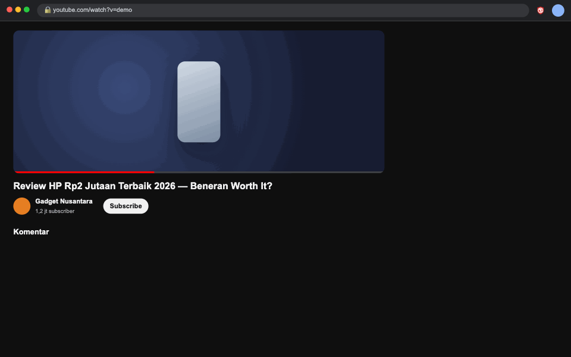
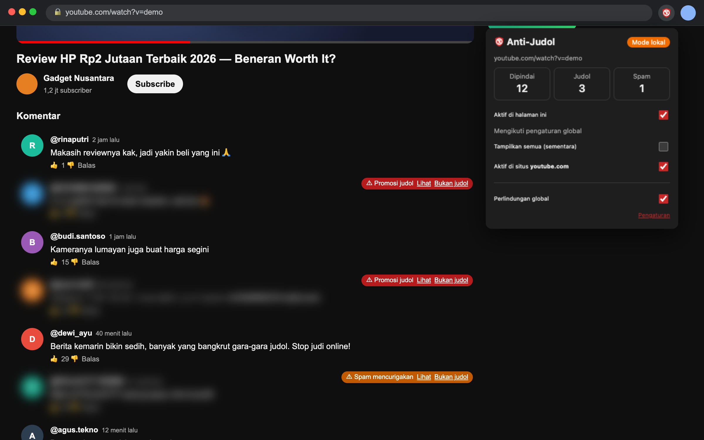

<p align="center">
  
</p>

<h1 align="center">Anti-Judol Shield</h1>

<p align="center">
  Menyembunyikan spam judi online (judol) di YouTube dan di berbagai situs, serta memblokir situs judi.<br />
  <a href="README.md">English</a> · <a href="PRIVACY.md">Privasi</a> · <a href="https://github.com/Leon24k/anti-judol/issues">Laporkan masalah</a>
</p>

<p align="center">
  
</p>

<details>
<summary><b>Screenshot</b></summary>
<p align="center">
  
</p>
</details>

## Kenapa

Kolom komentar YouTube penuh iklan judi seperti "slot gacor", "maxwin", dan "JUDI888". Tulisannya sengaja disamarkan supaya lolos dari filter biasa: `s l o t`, `g4c0r`, `𝐉𝐔𝐃𝐈𝟖𝟖𝟖`, `ｓｌｏｔ`, `kasino310 (dot) com`.

Anti-Judol Shield membongkar penyamaran itu dan mem-blur spamnya sebelum sempat kamu lihat. Komentar biasa tidak disentuh, termasuk komentar yang *membahas* judi, seperti berita atau peringatan.

## Fitur

- **Instan.** Spam yang jelas langsung di-blur sebelum muncul di layar, dan scroll tetap mulus.
- **Tembus penyamaran.** Mengenali huruf berspasi, angka pengganti huruf, font Unicode aneh, huruf kembar dari alfabet lain, karakter tersembunyi, dan link yang disamarkan.
- **Bekerja di komentar, live chat, dan judul video**, di YouTube desktop maupun mobile.
- **Tidak cuma YouTube.** Bisa juga dinyalakan untuk X, Reddit, Twitch, kolom komentar Disqus, serta (beta) Facebook, Instagram, dan TikTok.
- **Memblokir situs judi.** Lebih dari 140.000 domain judol dihentikan sebelum sempat dimuat, dan kamu melihat halaman peringatan sebagai gantinya.
- **Membersihkan situs biasa (opsional).** Menyembunyikan banner judi, iframe iklan, dan link spam di situs berita, streaming, maupun blog. Juga memberi peringatan kalau sebuah situs diretas untuk promosi judi.
- **Lapor dengan sekali klik.** Tombol **Laporkan** menyiapkan laporan yang tinggal ditempel ke [aduankonten.id](https://aduankonten.id), layanan aduan konten milik Komdigi.
- **Kamu yang pegang kendali:**
  - Klik komentar yang di-blur kalau tetap ingin membacanya.
  - Tombol **"Bukan judol"** memperbaiki salah deteksi supaya komentar itu tidak disembunyikan lagi.
  - Perlindungan bisa dimatikan untuk satu video saja, untuk seluruh YouTube, atau total.
  - **"Tampilkan semua (sementara)"** menampilkan semua komentar di halaman yang sedang dibuka.
  - Tambahkan kata kunci sendiri yang selalu disembunyikan atau tidak pernah disembunyikan.
  - Ekspor/impor pengaturan, atau sinkronkan antar komputer lewat akun Chrome.
- **Privat sejak awal.** Semua berjalan di perangkatmu. Tidak ada data tentang kamu yang dikirim kecuali kamu sendiri yang menyalakan mode AI.
- **Mode AI opsional** memakai [Jev dari TypeSafe](https://typesafe.ai) untuk menangkap spam halus tanpa kata kunci jelas, misalnya "modal receh jadi jutaan, cek profil aku".

## Instalasi

> Segera tersedia di Chrome Web Store.

Sementara itu, pasang manual di Chrome, Edge, Brave, atau browser Chromium lain:

1. Pasang [Bun](https://bun.sh), lalu jalankan:
   ```sh
   git clone https://github.com/Leon24k/anti-judol.git
   cd anti-judol
   bun install
   bun run build
   ```
2. Buka `chrome://extensions` (atau `edge://extensions`).
3. Nyalakan **Developer mode** di pojok kanan atas.
4. Klik **Load unpacked**, lalu pilih folder `dist`.
5. Buka video YouTube mana saja. Spam judi akan langsung di-blur, dan situs judi yang dikenal otomatis diblokir.

## Cara pakai

Klik ikon perisai di toolbar browser untuk:

- melihat jumlah komentar yang diperiksa dan disembunyikan di halaman ini,
- mematikan perlindungan untuk video ini atau untuk seluruh YouTube,
- menampilkan semua komentar untuk sementara.

Di komentar yang di-blur:

- **Lihat** membuka komentarnya, dan **Sembunyikan** menutupnya lagi.
- **Bukan judol** menandai bahwa itu bukan spam judi. Komentar langsung dibuka dan tidak akan disembunyikan lagi.
- **Laporkan** menyalin isi laporan (link, isi komentar, dan waktunya) lalu membuka aduankonten.id. Tempel ke formulirnya dan kirim. Tidak ada yang terkirim otomatis.

Pengaturan lain ada di menu **Pengaturan** (klik kanan ikon → *Options*), misalnya pilihan blur atau sembunyikan total, tingkat sensitivitas, dan area yang dipindai.

## Di luar YouTube

Semua fitur ini ada di **Pengaturan**. Chrome akan meminta izin saat masing-masing fitur dinyalakan, dan izinnya bisa dicabut kapan saja.

- **Platform lain.** Di bagian **Platform**, centang X, Reddit, Twitch, Disqus, Facebook, Instagram, atau TikTok. Chrome hanya meminta akses ke situs itu saja. Muat ulang tab situs tersebut yang sudah terbuka.
- **Blokir situs judi** aktif sejak awal. Fitur ini memakai [daftar HaGeZi Gambling](https://github.com/hagezi/dns-blocklists) yang dikelola komunitas dan diperbarui tiap 12 jam, dan kamu bisa menambahkan domain sendiri. Situs pemerintah, kampus, bank, dan platform besar tidak akan pernah diblokir, meskipun daftarnya keliru. Kalau ada situs yang salah diblokir, pilih **Ini bukan situs judi?** di halaman peringatan.
- **Semua situs.** Nyalakan **Sembunyikan iklan, banner & link judi di semua situs** untuk membersihkan iklan judi di mana saja. Fitur ini butuh izin akses ke semua situs. Pemeriksaannya sepenuhnya di perangkatmu: isi halaman tidak pernah dikirim ke mana pun, termasuk ke AI. Dengan fitur ini, situs judi yang diblokir juga menampilkan halaman peringatan yang jelas, bukan layar error.

## Mode AI (opsional)

Filter bawaan sudah menangkap sebagian besar spam. Untuk kasus yang lebih licin, kamu bisa menyalakan klasifikasi AI:

1. Ambil API key dari [TypeSafe](https://console.typesafe.ai).
2. Buka **Pengaturan** ekstensi, tempel key-nya, lalu centang kotak persetujuan.
3. Klik **Tes koneksi Jev** untuk memastikan key-nya berfungsi.

Saat mode AI aktif, teks komentar yang kamu scroll dan nama pengirimnya dikirim ke TypeSafe untuk diperiksa. Tidak ada data lain yang dikirim. Key hanya disimpan di browsermu dan tidak ditampilkan lagi setelah disimpan. Ada batas harian (default 20.000 komentar) supaya pemakaian tetap terkendali. Kamu juga bisa menambahkan key [OpenRouter](https://openrouter.ai) sebagai cadangan kalau TypeSafe sedang tidak bisa diakses. OpenRouter mengenakan biaya kecil per pemakaian.

## Privasi

- Tanpa mode AI, **tidak ada data tentang kamu yang keluar dari komputermu**. Satu-satunya unduhan otomatis adalah daftar publik domain judi.
- Tidak ada akun, pelacakan, analitik, maupun server milik kami.
- Ekstensi berjalan di YouTube dan di situs yang kamu aktifkan saja. Pemblokiran dilakukan Chrome sendiri, jadi ekstensi tidak tahu situs apa saja yang kamu buka.

Detail lengkap ada di [kebijakan privasi](PRIVACY.md).

## Tanya jawab

**Komentar biasa ikut ke-blur, gimana?**
Klik **Bukan judol** di komentar itu, dan komentar tersebut tidak akan disembunyikan lagi. Kalau sering terjadi, turunkan sensitivitas di Pengaturan atau [buka issue](https://github.com/Leon24k/anti-judol/issues) dengan contohnya.

**Masih ada spam yang lolos.**
Nyalakan mode AI atau naikkan sensitivitas. Contoh spam yang lolos juga sangat membantu untuk memperbaiki filter bawaan, jadi silakan dilaporkan.

**Bikin YouTube lemot nggak?**
Tidak. Pemeriksaan per komentar butuh kurang dari satu milidetik, dan hanya komentar di dekat layar yang diperiksa.

**Kenapa minta akses "semua situs"?**
Tidak diminta, kecuali kamu menyalakan opsi semua situs. YouTube jalan tanpa izin itu, dan platform lain hanya meminta akses ke situsnya masing-masing. Pemblokiran situs judi juga tetap jalan tanpa izin itu, bedanya kamu akan melihat layar error Chrome, bukan halaman peringatan.

**Situs biasa ikut terblokir.**
Di halaman peringatan, buka **Ini bukan situs judi?** lalu pilih **Bukan situs judi, jangan blokir lagi**. Bisa juga dengan menambahkannya di **Jangan pernah blokir** di Pengaturan. Tolong [laporkan juga](https://github.com/Leon24k/anti-judol/issues) supaya daftarnya bisa diperbaiki.

**Bisa untuk bahasa lain?**
Filter bawaan dirancang untuk spam judi berbahasa Indonesia dan Inggris. Mode AI memahami lebih banyak bahasa.

## Kontribusi

Laporan bug, contoh spam yang lolos, dan pull request sangat diterima. Cara kerja teknisnya dijelaskan di [docs/ARCHITECTURE.md](docs/ARCHITECTURE.md).

```sh
bun install
bun run check   # typecheck + unit test + build
bun run e2e     # tes end-to-end di Chrome asli
```

## Lisensi

[MIT](LICENSE). Daftar domain judi diunduh saat ekstensi berjalan dari [HaGeZi DNS blocklists](https://github.com/hagezi/dns-blocklists) (GPL-3.0) dan bukan bagian dari repositori ini.
